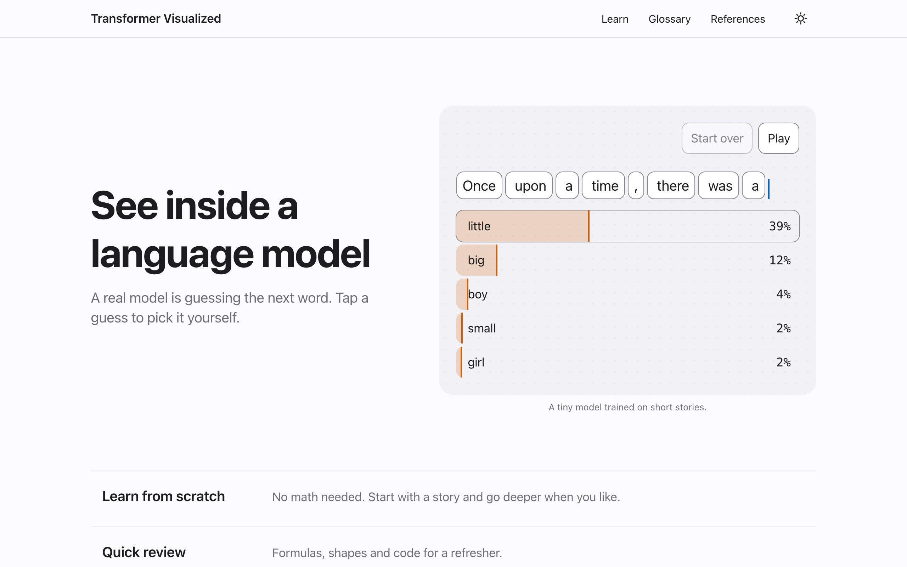
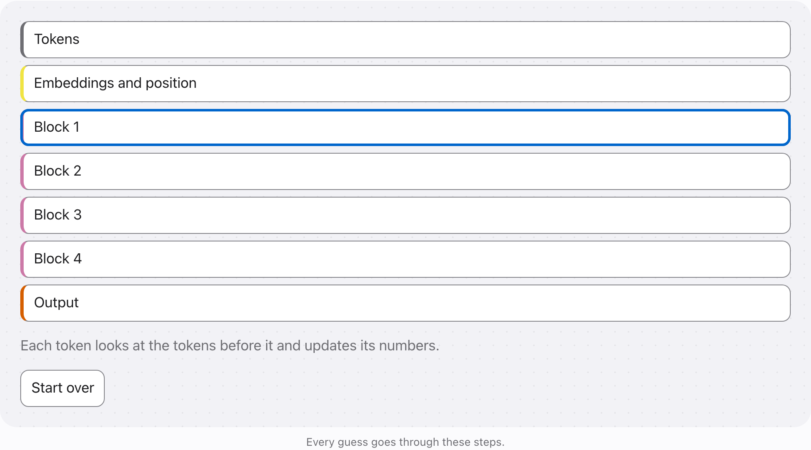
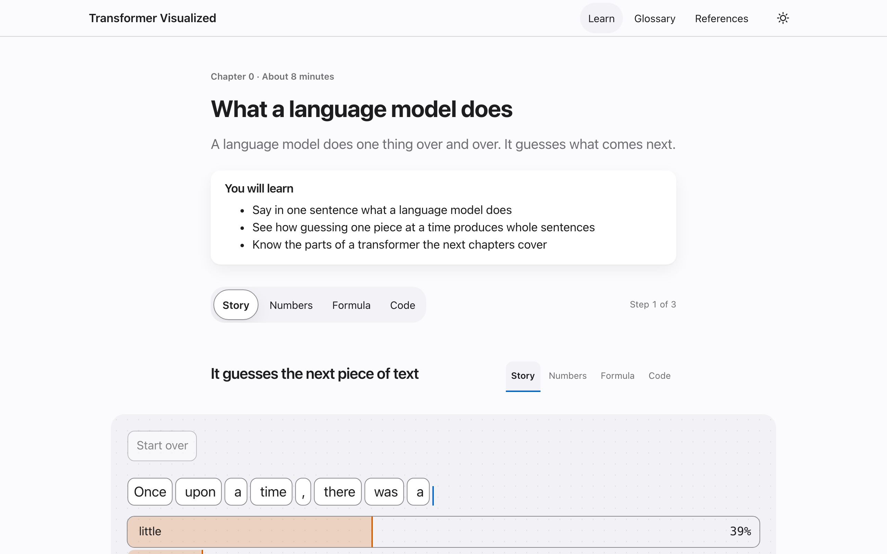
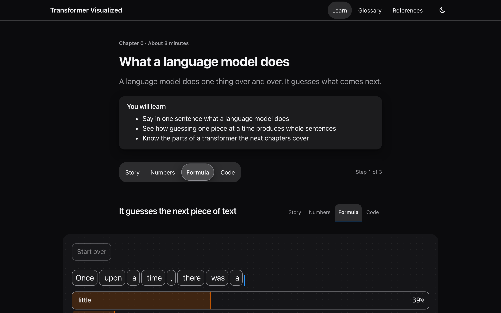
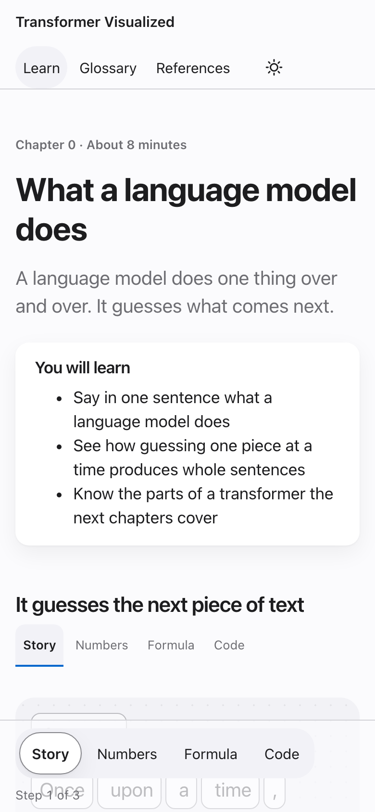

# Transformer Visualized

A friendly, visual guide to how language models like GPT work.

You type a sentence and follow it through a real transformer, one step at a time, until it guesses the next word. Every number on screen comes from a real model, and you can always see the math behind it.



## Who it's for

This is a learning resource. It is the guide we wish we had when we were first learning how transformers work.

- **Learning it for the first time.** No math background needed. Each idea starts as a short story, and you can go deeper whenever you're ready.
- **Refreshing what you know.** Jump straight to the formulas, tensor shapes and code. The glossary is there when you need a quick reminder.
- **Teaching it.** Use the pages in a class, a study group or a talk. The lessons are free to share and adapt under CC BY 4.0, as long as you give credit.

## How to use it

**1. Watch it guess.** The home page shows a real model guessing the next word. Tap any guess to pick it yourself, and the model guesses again from there.


**2. Pick how deep to go.** Each chapter starts as a story. Switch to Numbers, Formula or Code at any time.


**3. Play with the figures.** Every step has something to touch. Pick a guess and see the exact chances.


**4. See a sentence grow.** Add one guess at a time. A long answer is just many single guesses.


**5. Look inside.** Tap each part of the model to see what it does.



Every figure has a Start over button, and everything works with a keyboard and a screen reader.

## What you can do

Some of this is still being built. The next section shows what is ready today.

- **Pick your depth.** Every step can be read four ways, as a story, as worked numbers, as the formula or as code. Switch at any time.
- **Look inside a real model.** A tiny GPT-2 style model, trained on short children's stories, runs right in your browser. You can inspect every number it produces.
- **Start small.** A toy example is small enough to work out by hand before you meet the real thing.
- **Check the sources.** The references page lists every paper with a pinned link, and simplifications are labeled as ours.
- **Use it anywhere.** It runs in the browser with no account, no server and no tracking.

## What's ready and what's next

The project is in early development.

**Ready now**

- The site, with light and dark mode, and layouts for phone and desktop.
- A live demo on the home page, with real guesses from the model.
- The first chapter, "What a language model does", with three figures to play with.
- The glossary and the references page.
- The tiny trained model and the engine that runs it.

**Coming next**

- Four chapters that take you from text to a prediction. They cover tokens, embeddings and position, attention, and how the model picks the next word.
- The playground, where you type your own sentence and watch it move through the model.
- Quick review cards with every formula in one place.
- Offline use, so you can install the site and study without internet.

**Later**

- A chapter on the full transformer block.
- How training works.
- A bigger GPT-2 sized model.

## Screenshots







## How to run

You need [Node.js](https://nodejs.org/) 22.13 or newer (24 is recommended) and Git.

1. Get the code and install everything.

   ```sh
   git clone https://github.com/dwinzg/transformer-visualized.git
   cd transformer-visualized
   npm install
   ```

2. Start the site.

   ```sh
   npm run dev --workspace @transformer-visualized/site
   ```

   Then open http://localhost:4321/transformer-visualized/ in your browser. The page reloads as you edit.

3. Check your changes before opening a pull request.

   ```sh
   npm run check
   ```

   This runs the format check, lint, type checks and unit tests. To run the browser tests too, install the test browsers once with `npx playwright install` and then run `npm run e2e`.

To build the site the way it is published, run `npm run build`. The finished pages land in `site/dist/`.

The model is trained with Python, which you only need if you want to retrain it. The steps are in [model/README.md](model/README.md).

## Contributing

Contributions are welcome, especially from people who are learning this for the first time. If something confused you, that's useful to hear. See [CONTRIBUTING.md](CONTRIBUTING.md) for how to help, the writing style and how we cite sources.

## License

Copyright (c) 2026 dwinzg

- Code is released under the [MIT License](LICENSE).
- Written lessons, explanations and figures are released under the [Creative Commons Attribution 4.0 International License](https://creativecommons.org/licenses/by/4.0/) (CC BY 4.0), unless otherwise noted. The full text is in [LICENSE-CONTENT](LICENSE-CONTENT).
- Code samples inside the lessons are also available under the MIT License.
- Third-party material keeps its original license.
- The trained model in `models/` is released under the MIT License, like the code.
- The dataset it was trained on is credited in [THIRD_PARTY_NOTICES.md](THIRD_PARTY_NOTICES.md).
