# Transformer Visualized

A friendly, visual guide to how language models like GPT work.

You follow a sentence through a real transformer, one step at a time, until it guesses the next word. Every number on screen comes from a real model, and you can always see the math behind it.

## Who it's for

This is a learning resource. It is the guide we wish we had when we were first learning how transformers work.

- **Learning it for the first time.** No math background needed. Each idea starts as a short story, and you can go deeper whenever you're ready.
- **Refreshing what you know.** Jump straight to the formulas, tensor shapes and code. The glossary is there when you need a quick reminder.
- **Teaching it.** Use the pages in a class, a study group or a talk. The lessons are free to share and adapt under CC BY 4.0, as long as you give credit.

## How to use it

### Watch it guess

The home page shows a real model writing a sentence, one guess at a time. Tap any guess to pick it yourself. The model keeps going until the sentence ends.

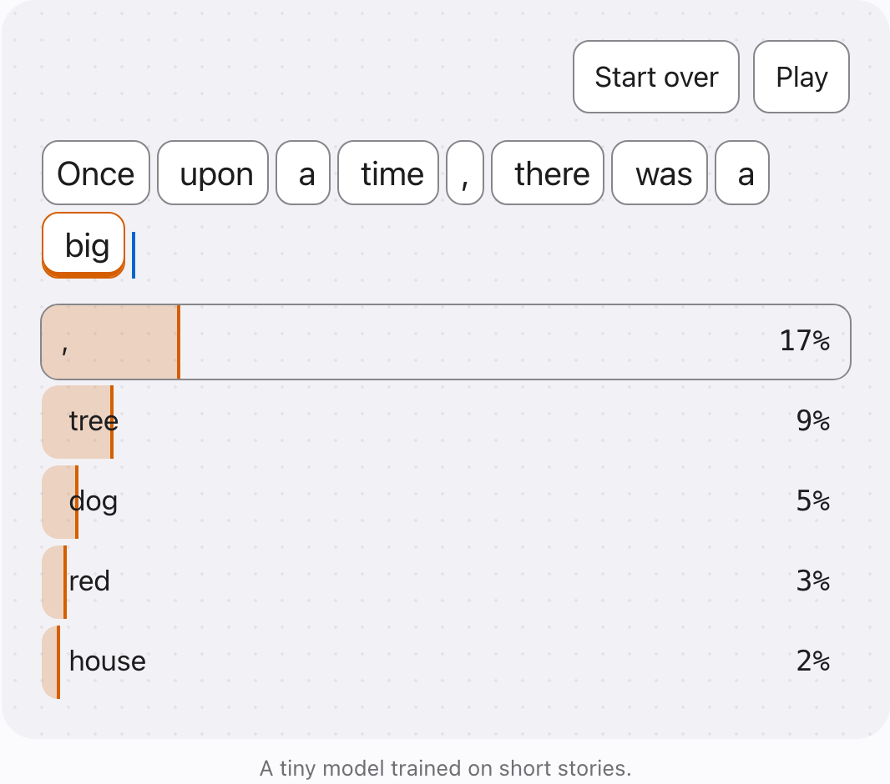

### Learn from scratch

Five short chapters follow one sentence through the model, and three more show how it is used today, with prompts, tools and reasoning. Each step starts as a story. Switch to Numbers, Formula or Code at any time.

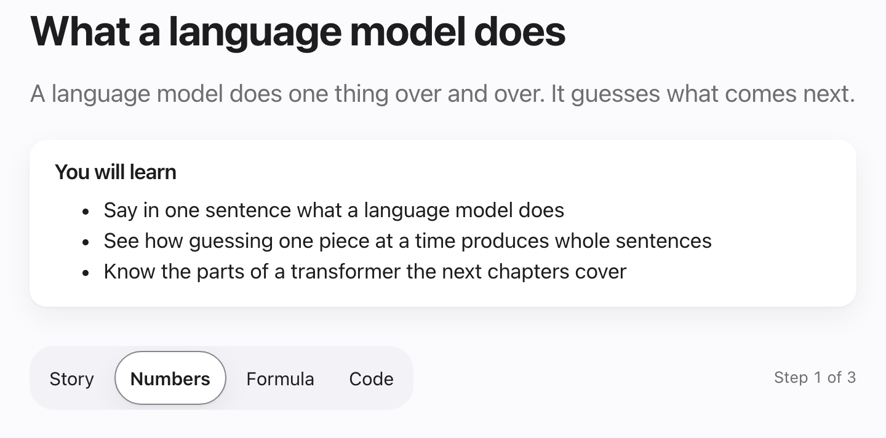

Every step has a figure to touch. Pick a guess and see the exact chances, or add one guess at a time and watch a sentence grow.

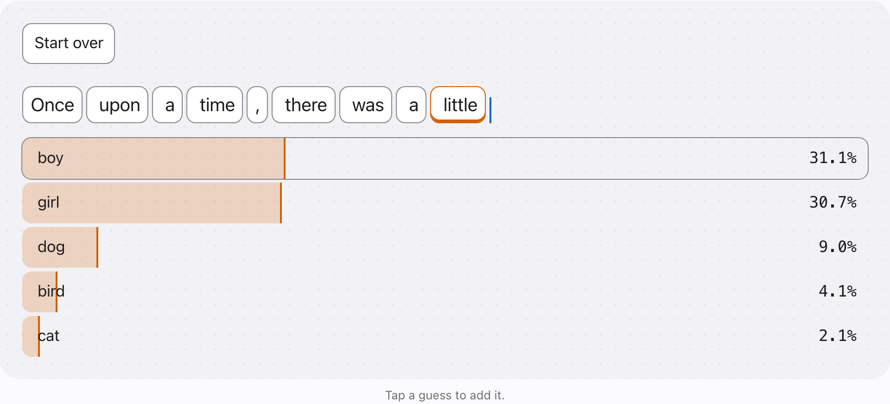

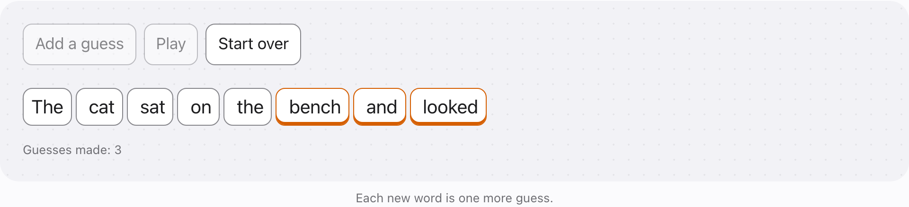

The later chapters show how the same model is used today. Slide a note out of the model's window and watch it forget, or compare guesses with and without a sentence in the prompt.

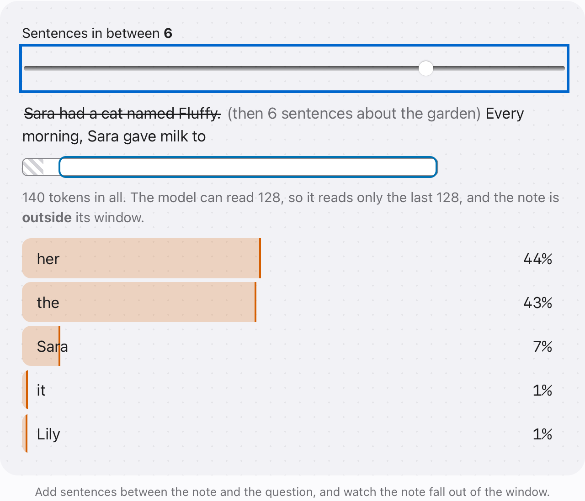

### See the whole model

The diagram from the paper, Figure 1 of "Attention Is All You Need", redrawn so you can tap every box. Each part has a short article with its sizes, the formula and a few lines of PyTorch. The code runs on our real model and prints the same numbers you see on the page. Switch to the Llama style to see what newer models changed, part by part, with code that runs on our second model.

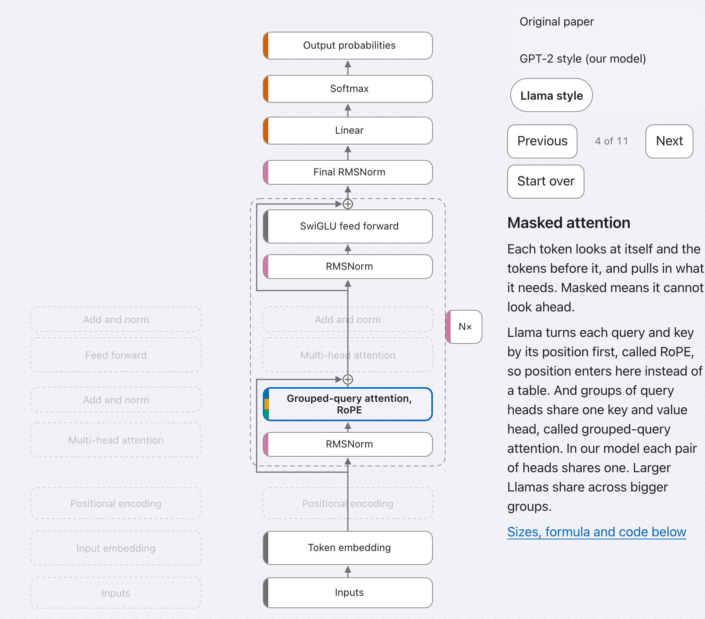

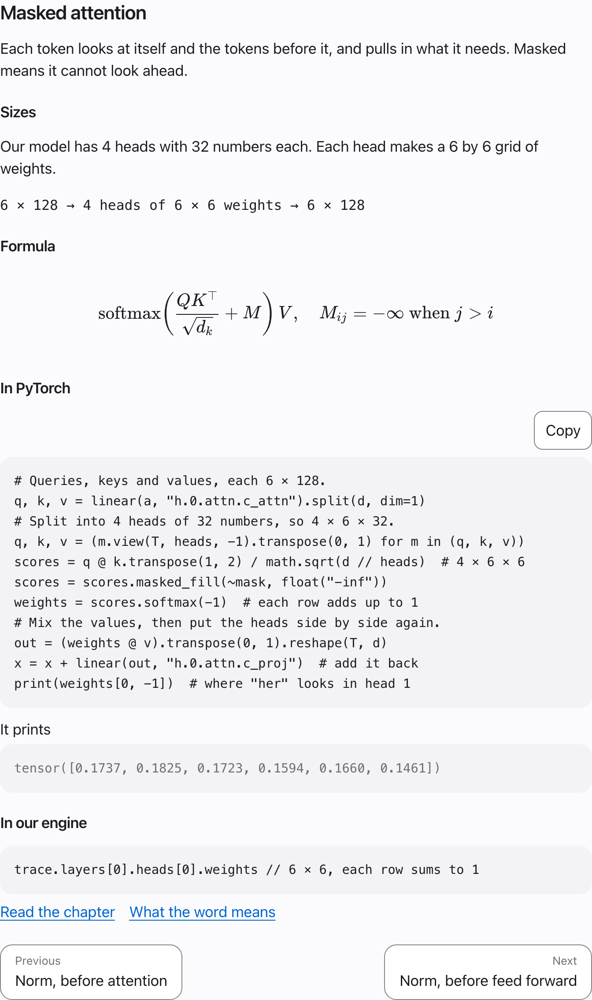

### Review it all on one page

The quick review has the shapes, formula and code for every part, in the order a sentence passes through them.

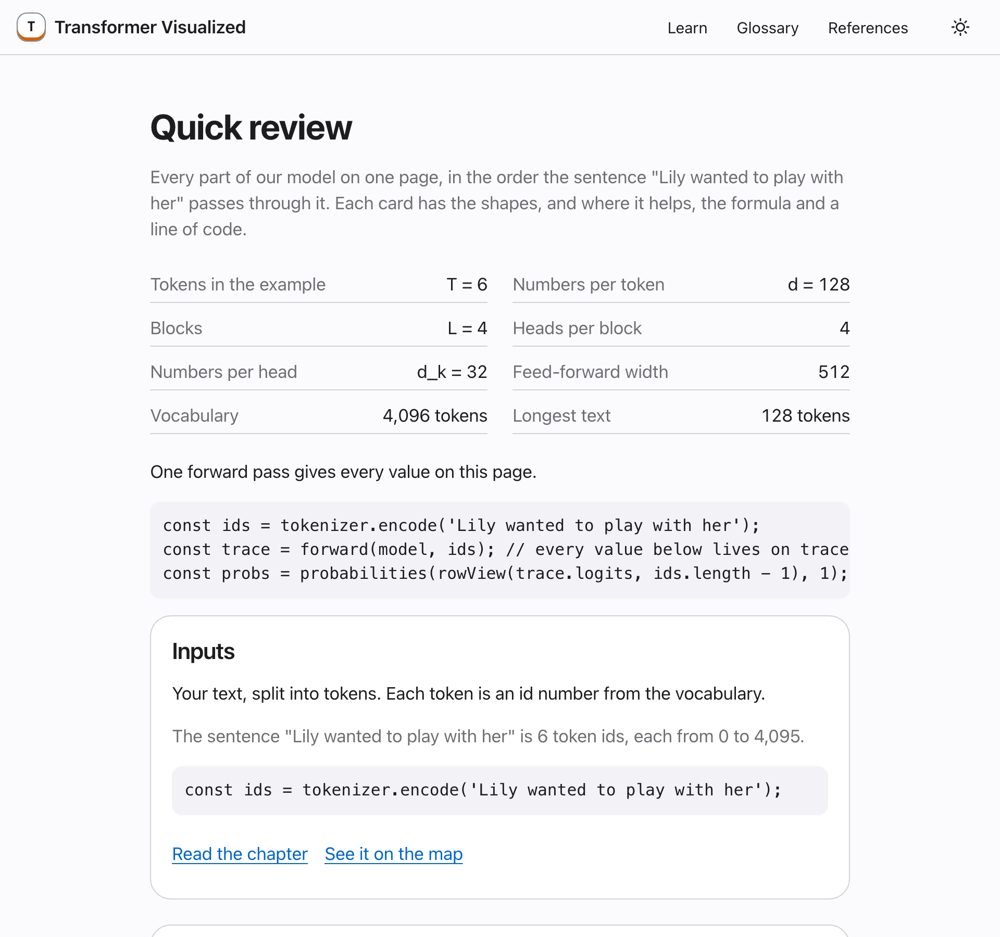

### Try your own text

The playground runs the model on anything you type. Look at each stage, sample the next token and add it to your text. Copy link shares what you typed.

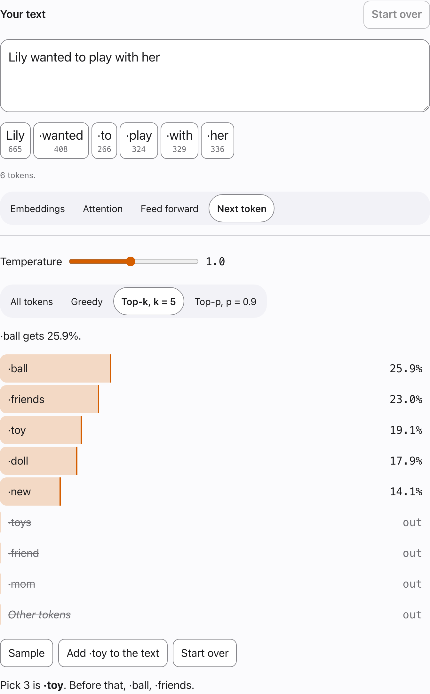

Pick a layer and a head to see what each token looks at, and the scores behind those weights.

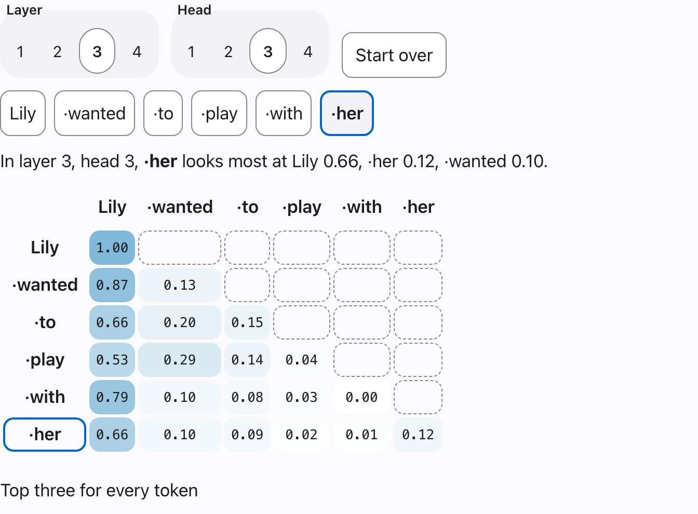

### Watch it learn

Slide through the model's training, from blind guessing to whole stories. See the loss fall, the guesses sharpen, and the moment it starts using a name from an earlier sentence.

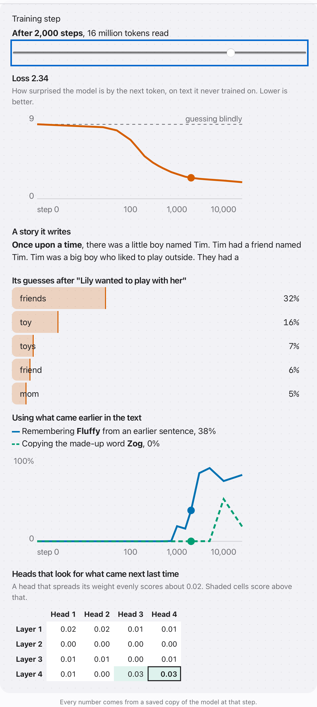

### Find your way

Every page is one step away. The Learn menu in the header lists the chapters, the whole model and the quick review. On a phone, it all sits behind one Menu button.

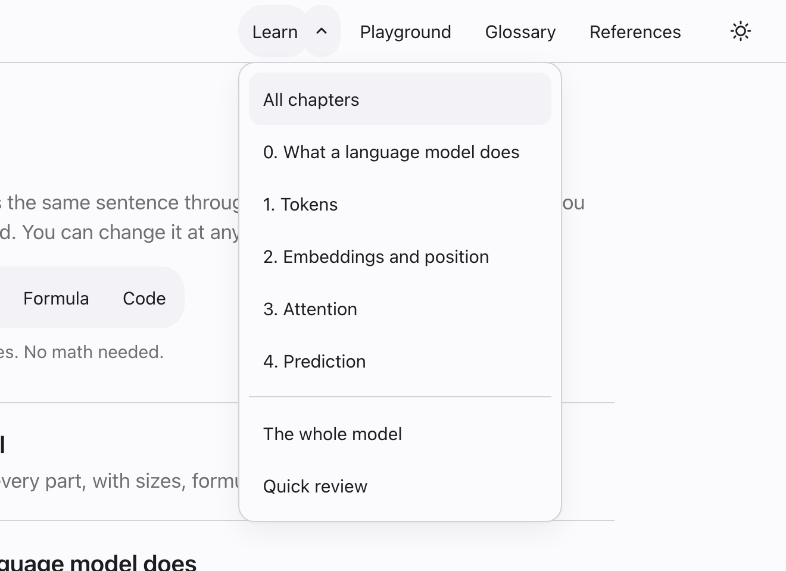

Search finds any term, step, question or source, and shows the words it matched. Questions and answers covers what people often ask, each answer linked to the step that explains it.

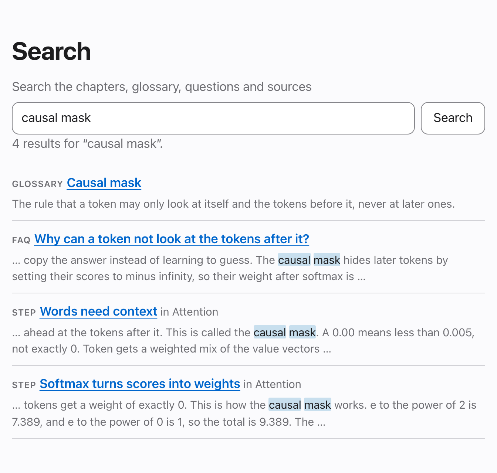

Every figure has a Start over button, and everything works with a keyboard and a screen reader.

## What's inside

- **Eight chapters.** What a language model does, tokens, embeddings and position, attention, and prediction. Then context and prompts, retrieval and tools, and thinking step by step.
- **Search and answers.** Search the whole site, or read short answers to common questions, each linked to its step and source.
- **A tiny real model.** A GPT-2 style model, trained on short children's stories, runs right in your browser. You can inspect every number it produces.
- **Two designs side by side.** A second tiny model in the Llama style, with RMSNorm, rotary positions, a gated feed forward and grouped-query attention. Switch between them on the map and in the playground.
- **Toy examples.** Small enough to work out by hand before you meet the real thing.
- **Sources you can check.** The references page lists every paper with a pinned link, and points to what to read next about today's models. Simplifications are labeled as ours.
- **Works anywhere.** It runs in the browser with no account, no server and no tracking. Install it and it works offline too.

The [issues](https://github.com/dwinzg/transformer-visualized/issues) list ideas for what comes next, and contributions are welcome.

## How to run

You need [Node.js](https://nodejs.org/) 22.13 or newer (24 is recommended) and Git.

1. Get the code and install everything.

   ```sh
   git clone https://github.com/dwinzg/transformer-visualized.git
   cd transformer-visualized
   npm install
   ```

2. Start the site.

   ```sh
   npm run dev --workspace @transformer-visualized/site
   ```

   Then open http://localhost:4321/transformer-visualized/ in your browser. The page reloads as you edit.

3. Check your changes before opening a pull request.

   ```sh
   npm run check
   ```

   This runs the format check, lint, type checks and unit tests. To run the browser tests too, install the test browsers once with `npx playwright install` and then run `npm run e2e`.

To build the site the way it is published and look at it, run these two commands. The finished pages land in `site/dist/`.

```sh
npm run build
npm run preview --workspace @transformer-visualized/site
```

Then open http://localhost:4321/transformer-visualized/. Offline use only works in this build, not in `npm run dev`.

The model is trained with Python, which you only need if you want to retrain it. The steps are in [model/README.md](model/README.md).

## Related projects

These explainers came first, and each is worth your time. They shaped what we tried to do differently here.

- [Transformer Explainer](https://poloclub.github.io/transformer-explainer/) runs GPT-2 live in your browser and shows each step as you type.
- [LLM Visualization](https://bbycroft.net/llm) walks through every multiply of a small model in 3D.
- [AnimatedLLM](https://animatedllm.github.io/) animates real models step by step for people new to the field, in several languages.
- [The Illustrated Transformer](https://jalammar.github.io/illustrated-transformer/) explains the original paper with clear drawings.
- [3Blue1Brown's neural network videos](https://www.3blue1brown.com/topics/neural-networks) build the intuition with animation, attention included.

What we add is one ladder from a plain story to the exact math, on a small model where you can trace every number.

## Contributing

Contributions are welcome, especially from people who are learning this for the first time. If something confused you, that's useful to hear. See [CONTRIBUTING.md](CONTRIBUTING.md) for how to help, the writing style and how we cite sources.

## License

Copyright (c) 2026 dwinzg

- Code is released under the [MIT License](LICENSE).
- Written lessons, explanations and figures are released under the [Creative Commons Attribution 4.0 International License](https://creativecommons.org/licenses/by/4.0/) (CC BY 4.0), unless otherwise noted. The full text is in [LICENSE-CONTENT](LICENSE-CONTENT).
- Code samples inside the lessons are also available under the MIT License.
- Third-party material keeps its original license.
- The trained model in `models/` is released under the MIT License, like the code.
- The dataset it was trained on is credited in [THIRD_PARTY_NOTICES.md](THIRD_PARTY_NOTICES.md).

## Acknowledgements

We built this project with help from [Claude](https://claude.com/claude-code) and [Gemini](https://gemini.google.com), AI assistants from Anthropic and Google. They helped us write and test the code, lessons and figures, and made the whole process much faster. Every change still went through the tests and a review before it was merged.
